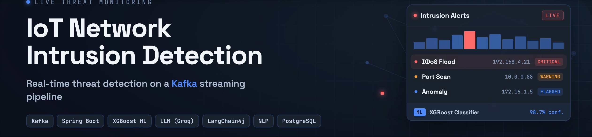
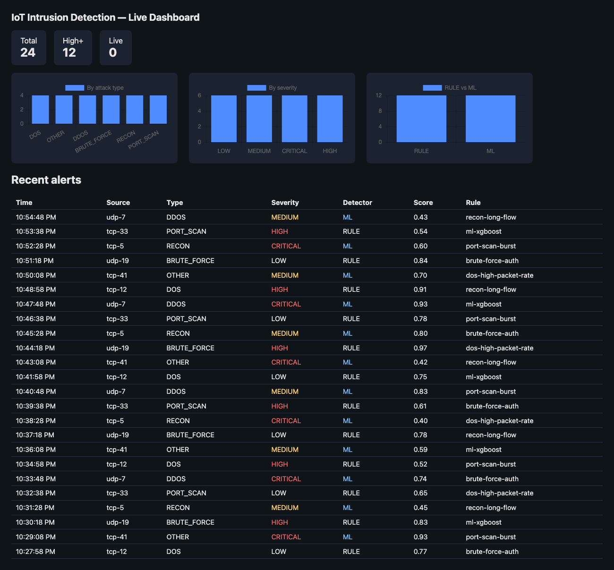
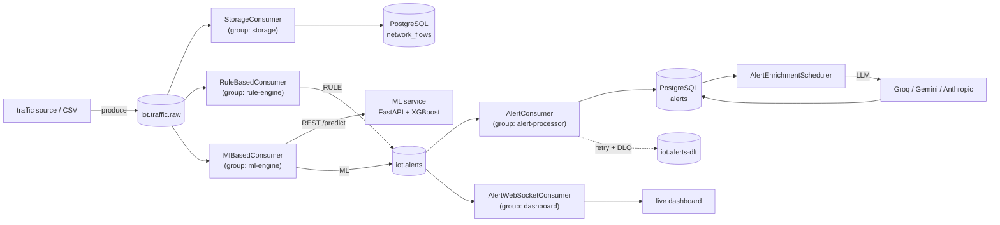
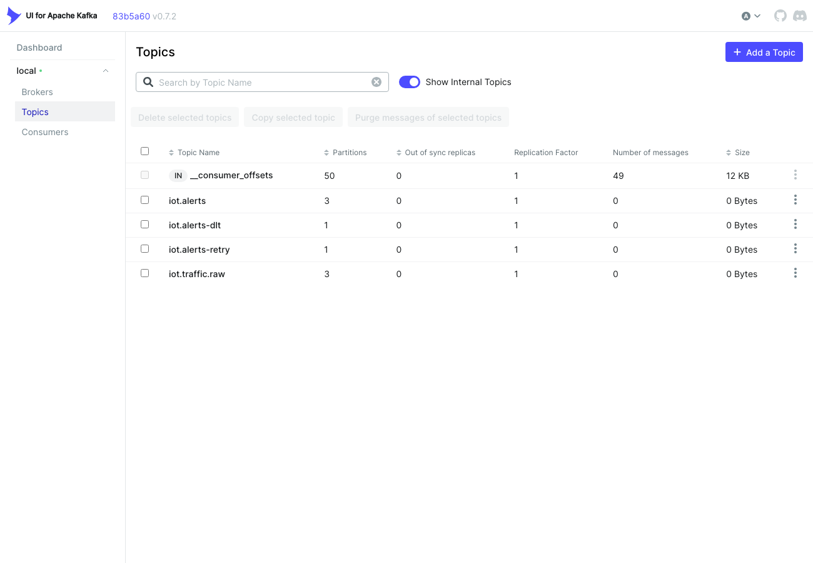
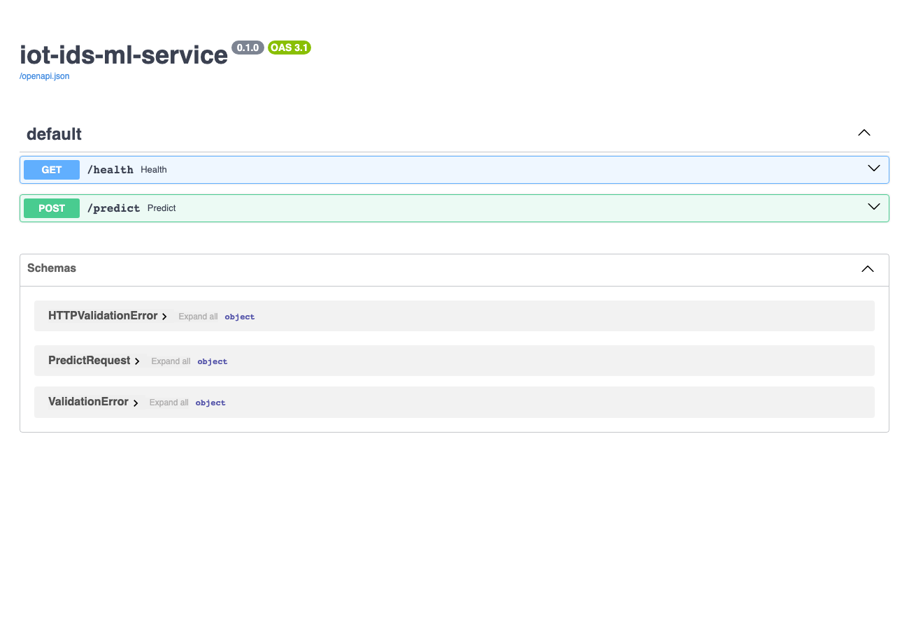

<p align="center">
  
</p>

# IoT Network Intrusion Detection

A Kafka-based streaming system that performs near real-time intrusion detection on
RT-IoT2022 network traffic. Built with Spring Boot producers/consumers, PostgreSQL,
rule-based and ML-based anomaly detection, a REST API with a live dashboard, and an
LLM layer (alert enrichment + natural-language chat) that runs on a free provider.

## Demo

### Live dashboard



Real-time alert table (fed over WebSocket) with severity, detector (RULE / ML) and score,
plus live charts by attack type, severity, and detection source.

### Streaming architecture



Each detector is its own Kafka consumer group, so storage, rule-based and ML detection
independently receive every traffic message; alert delivery uses a retry topic and a
dead-letter topic.



### ML detection service

A FastAPI + XGBoost microservice classifies each flow.



```bash
curl -s -X POST localhost:8000/predict -H "Content-Type: application/json" \
  -d '{"features": {"fwd_pkts_tot": 1500, "flow_duration": 2.3}}'
# {"attack_type": "PORT_SCAN", "score": 0.826}
```

### LLM enrichment & natural-language chat (free — runs on Groq by default)

A scheduled poller enriches each alert with a plain-language explanation and recommendation:

```json
{
  "attackType": "DDOS", "severity": "MEDIUM", "detectionSource": "ML",
  "llmExplanation": "A medium-severity DDoS attack is detected, targeting DNS services over UDP, indicating potential reconnaissance activity.",
  "llmRecommendation": "Verify DNS server logs and implement rate limiting on UDP traffic to prevent abuse."
}
```

Ask questions in plain language — the assistant tool-calls the alert queries to answer:

```bash
curl -s -X POST localhost:8080/api/chat -H "Content-Type: application/json" \
  -d '{"question": "Give me an overall threat summary."}'
# {"answer": "There have been a total of 24 alerts detected, with 12 from rule-based detection
#   and 12 from machine learning-based detection ... 4 alerts of each type ... 6 of each severity."}
```

The provider is configurable (`app.llm.provider = groq | gemini | anthropic`); Groq's free
tier needs no credit card. See [Configuration](#configuration).

## Architecture (Phase 1 — ingest & store)

```
CSV  ->  Kafka (iot.traffic.raw)  ->  StorageConsumer  ->  PostgreSQL
```

A `CsvReplaySimulator` reads the RT-IoT2022 CSV schema-agnostically and publishes each
flow as a `TrafficEvent` to the `iot.traffic.raw` topic (keyed by source). `StorageConsumer`
consumes the topic and persists each flow into the `network_flows` table.

## Phase 2 — Rule-based detection

```
                         ┌─ StorageConsumer (group: storage)        -> network_flows
iot.traffic.raw  ────────┤
                         └─ RuleBasedConsumer (group: rule-engine)  -> iot.alerts
                                                                          │
                                              AlertConsumer (group: alert-processor) -> alerts
                                              (retry + dead-letter: iot.alerts-dlt)
```

Rules are config-driven thresholds defined under `app.rules` in `application.yml`, so new
detections are added without code changes. Because `rule-engine` is a separate consumer
group from `storage`, both consumers independently receive every traffic message.

## Phase 3 — ML-based detection

```
                ┌─ StorageConsumer    (group: storage)     -> network_flows
iot.traffic.raw ┼─ RuleBasedConsumer  (group: rule-engine) -> iot.alerts (RULE)
                └─ MlBasedConsumer    (group: ml-engine)   -> ml-service /predict
                                                                 │  attack_type != NORMAL
                                                                 ▼
                                                             iot.alerts (ML)
```

A Python FastAPI service (`ml-service/`) serves an XGBoost classifier trained offline
(`train.py`, on RT-IoT2022 if present, otherwise on synthetic labeled data). `MlBasedConsumer`
reads `iot.traffic.raw` under its own consumer group, calls the model over REST with a timeout,
and publishes `detectionSource=ML` alerts. If the ML service is unavailable the call falls back
silently — storage and rule-based detection are unaffected. ML can be toggled with `app.ml.enabled`.

Run the ML service with `docker compose up -d --build ml-service` (or locally: `cd ml-service &&
pip install -r requirements.txt && python train.py && uvicorn app:app --port 8000`).

## Phase 4 — REST API, WebSocket & dashboard

```
iot.alerts ─┬─ AlertConsumer        (group: alert-processor) -> alerts table
            └─ AlertWebSocketConsumer (group: dashboard)     -> STOMP /topic/alerts -> browser
```

A read-only REST API exposes recent alerts (`GET /api/alerts`, optional `?severity=`) and
aggregate stats (`GET /api/stats`). A new `dashboard` consumer group relays each alert over
STOMP/WebSocket (`/ws` → `/topic/alerts`). The static dashboard (`src/main/resources/static/`,
Chart.js) shows a live alerts table fed by WebSocket plus charts refreshed from `/api/stats`.

Run the app (`./mvnw spring-boot:run`) and open `http://localhost:8080/`. Publish traffic to
`iot.traffic.raw` (see Phase 1) to see rule-based and ML alerts appear live.

## Phase 5 — LLM enrichment and natural-language chat

```
alerts table  -->  AlertEnrichmentScheduler  -->  SecurityAnalystService  -->  alerts.llm_explanation / llm_recommendation
```

**Scheduled enrichment poller:** A background scheduler polls for alerts that have no LLM
explanation yet (ordered by creation time, configurable batch size) and calls
`SecurityAnalystService` for each one. The service sends alert metadata to an LLM and writes
the returned `explanation` and `recommendation` back to the `alerts` table via
`applyLlmEnrichment`. Per-alert errors are caught and logged so a single failure does not
stop the batch.

**Natural-language chat (`POST /api/chat`):** `NlQueryService` wires an LLM assistant with
tool-calling over the existing REST query layer (`AlertQueryTools`). The assistant can answer
questions such as "how many HIGH alerts in the last hour?" by invoking the right query tool and
returning a plain-language answer. When LLM is disabled the endpoint returns `503 Service
Unavailable`.

**Configuration (`application.yml`):**

| Key | Purpose |
|-----|---------|
| `app.llm.enabled` | Enable/disable all LLM features (default `false`) |
| `app.llm.provider` | LLM provider: `groq` (default), `gemini`, or `anthropic` |
| `app.llm.groq.model` | Groq model id |
| `app.llm.gemini.model` | Gemini model id |
| `app.llm.anthropic.model` | Anthropic model id |
| `app.llm.timeout` | Per-call timeout |
| `app.llm.enrichment.batch-size` | Alerts processed per scheduler tick |
| `app.llm.enrichment.poll-interval` | Scheduler polling interval |

**Runtime requirement:** set the matching API key for your chosen `app.llm.provider`
(`GEMINI_API_KEY` for Gemini, `ANTHROPIC_API_KEY` for Anthropic) in the environment to use LLM features.
The test suite runs with `app.llm.enabled=false` and requires no API key.

## Tech stack

- Java 21, Spring Boot 4.1
- Apache Kafka (Confluent, KRaft mode)
- PostgreSQL 16 (JSONB feature storage)
- Testcontainers for integration tests
- LangChain4j
- Machine Learning and LLM Support through Python and FastApi
- Streaming and Security Hardening

## Configuration

Runtime configuration is supplied through environment variables. The committed
[`.env.example`](.env.example) documents every supported variable with its default value.

1. Copy the template to a local `.env` (which is gitignored):

   ```bash
   cp .env.example .env
   ```

2. Fill in the values. Everything has a working default that matches the bundled
   `docker compose` stack. To use the LLM features, choose a provider with
   `APP_LLM_PROVIDER` (`groq` by default, or `gemini` / `anthropic`), set that provider's
   API key (`GROQ_API_KEY` — free at https://console.groq.com — `GEMINI_API_KEY`, or
   `ANTHROPIC_API_KEY`), and set `APP_LLM_ENABLED=true`.

3. Load `.env` into your shell before starting the app — Spring Boot does **not** read
   `.env` automatically:

   ```bash
   set -a; source .env; set +a
   ```

**Never commit `.env` or a real key.** Groq and Gemini both have free tiers (no credit
card required); `ANTHROPIC_API_KEY` is billed per token on the Anthropic Developer
Platform, separate from any Claude Pro subscription.

## Running locally

```bash
docker compose up -d        # kafka, kafka-ui (:8085), postgres (:5432)
set -a; source .env; set +a # load your environment (see Configuration above)
./mvnw spring-boot:run      # application (:8080)
```

To replay the dataset, see `data/README.md`, then set `app.simulator.enabled=true`.

## Tests

```bash
./mvnw test
```

Integration tests spin up real Kafka and PostgreSQL containers via Testcontainers,
so Docker must be running.

## DATA CREDIT

https://www.kaggle.com/datasets/supplejade/rt-iot2022real-time-internet-of-things


